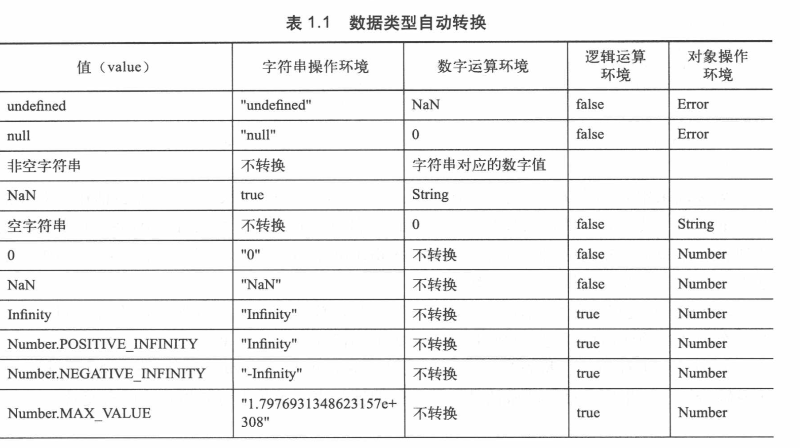
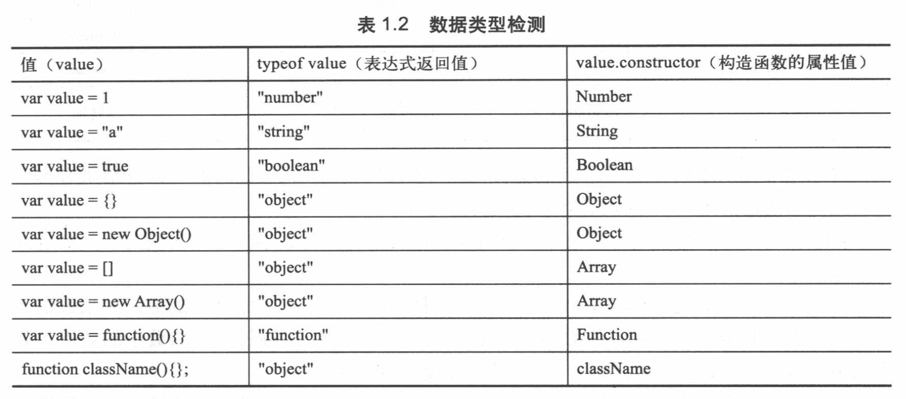

# 编写高质量代码：改善 javascript 程序的188 个建议
对于任何语言来说，如何选用代码的写法和算法最终会影响到执行效率。  
代码结构是执行速度的决定因素之一；性能损失与代码的组织方式及具体问题的解决办法直接相关；  
### 一、警惕 Unicode 乱码
ECMA标准规定JavaScript语言基于Unicode标准进行开发，JavaScript内核完全采用UCS字符集进行编写。  
ECMAScript v1，v2 只允许Unicode字符出现在注释或引号包含的字符串直接量中。  
考虑到js 兼容性及开发习惯，不建议使用中文命名变量及函数；  
现在浏览器都支持多种字符集，因此只需要页面字符编码与 js 语言编码一致，否则出现乱码。  
### 二、正确辨析 js 中的词、句、段
词法：字符编码、名词规则、特殊词规则；  
句法：语言的逻辑和结构，包括词句段的语法特性，段提现逻辑结构，句表达卡执行命令，词演绎逻辑的精髓，词演绎逻辑的精髓；  
段落使用完整的结构封装的独立的逻辑。  
语句一般至少包含一个词或段落，但是语句也可以什么都不包含，仅有一个分号，空语句。  
词语是 js 句法结构中的最小语义单位，包括指令，变量，直接量，运算符。  
### 三、减少全局变量污染
- 任何函数外面直接执行 var 语句；
- 直接添加一个属性到全局对象上，全局对象是全局变量的容器，在 web 浏览器中 全局对象是 window。
- 直接使用未经声明的变量，以这种方式定义的全局变量被称为隐式的全局变量；  

全局变量就是在所有作用域中都可见的变量。  
全局变量降低了程序的可靠性，一个全局变量可以被程序的任何部分在任何时间被改变，使得程序的行为被极大地复杂化。
全局变量的名称与子程序中的变量名称相同时，互相冲突可能导致程序无法运行，通常还会使程序难以调试。  
**努力减少使用全局变量的方法：在应用程序中创建唯一一个全局变量，并定义该变量为当前应用的容器。也可以使用闭包体将信息隐藏**  
js 支持函数作用域，定义在函数中的参数再函数外部是不可见的，并且在函数中的任意位置定义的变量都可以在函数任意位置访问到该变量，但是js 缺少块级作用域，最好的做法是在函数体的顶部声明函数中可能用到的所有变量。
### 四、注意 JavaSceipt 数据类型的特殊性
#### 1、防止浮点数溢出
二进制的浮点数不能正确的处理十进制的小数； 0.2 + 0.1 ！= 0.3
浮点数中的整数运算是精确的，所以小数表现出来的问题可以通过精度来避免。 (2+1)/10 = 0.3
#### 2、慎用 javascript 类型装换
javascript 一般遵循如果某个类型的值被用于需要其他类型的环境中，javascript 就自动将这个值转换成所需要的类型。


#### 3、正确检测数据类型  
typeof返回值：“number”，“string”，“boolean”，“object”，“function”，“undefined”
```javascript
//typeof 检测 null 结果为 object 应使用：
function typeof(o){
    return (o === null)? "null" : (typeof o);
}
```
- typeof 不能够检测复杂数据类型，以及各种特殊用途的对象，正则表达式对象，日期对象，数学对象；
- 对象或者数组 可以使用 contructor 属性。 undefined 或 null 特殊值不能使用 contructor；先转换为布尔值再判断；
- 使用 toString() 检测对象类型是最安全、最准确的；toString() 返回 [object class] object代表对象的通用类型；class 对象的内部类型；内部对象的名称与对象的构造函数名相同；通常不同对象都会有自己的预定义 toString 方法；需要调用 Object.prototype.toString,再调用apply方法在检测对象上执行
```javascript
var val = undefined;
alert(typeof val);    //undefined
alert( val && val.constructor);    //undefined

var val2 = null;
alert(typeof val2);    //object
alert( val && val2.constructor);    //null

alert((10).constructor); //数值直接量 需要使用括号

//toString 方法
var d = new Array();
var m = Object.prototype.toString;
console.log(m.apply(d));

//比较完整的检测类型的方法 安全检测数据类型及内置对象
//参数 o 表示检测的值
/*
* 返回值：undefined，number，boolean，string，function，regexp，array,date,error,object,null
*/
function(o){
    //获取 对象的toString 方法引用
    var _toString = Object.prototype.toString;
    // 枚举基本数据类型和内置对象类型，可以进一步补充该数组的检测数据类型范围
    var _type = {
        "undefined" : "undefined",
        "number" : "number",
        "boolean" : "boolean",
        "string" : "string",
        "[object function]" : "function",
        "[object RegExp]" : "regexp",
        "[object Array]" : "array",
        "[object Date]" : "date",
        "[object Error]" : "error"
    }
    return _typeof[typeof 0] || _typeof[_toString.call(o)] || (o ? "object" : "null");
}

```

#### 4、避免误用 parseInt
- 浮点数中的点号对于parseInt是非法字符；
- 以0为开头的数字字符串，parseInt函数会把它作为八进制数字处理；
- 在使用 parseInt 时一定要提供第二个参数，基数；parseInt("10",8);
### 五、防止 javascript 自动插入分号
js 有一个机制，在解析时，能够在一句话后面插入分号，用来修改语句末尾遗漏的分号分隔符；
js 中所有空格符都会被忽略；因此可以利用空格格式化代码。
```javascript
var f = function(){
    return
    {
        ststus : true
    }
}
// js 自动插入分号 ，返回 undefined
```
js 代码建议：1、不管一行内语句是否完整，只要是完整的语句都必须增加分号，以表示句子结束；2、当长句子需要分行时，在分行时应确保一行内不能形成完整的逻辑语义；
```javascript
var a = 
    b = 
    c = 4;
// 等同于
var a = b = c = 4;

//拆分
var i = a ? 1 : b ? 2 : c ? 3 : 4;
var i = a ? 1
        : b ? 2
        : c ? 3
        :4;
```
### 六、正确处理 javascript 特殊值
#### 1、正确使用 NAN 和 Infinity
NAN 是 IEEE 754 中定义的一个特殊 数量值； typeof NAN == "number"; //true